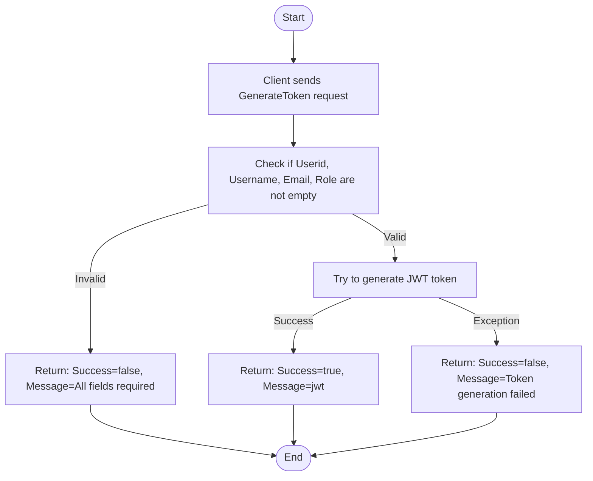

# GrpcAccountProfileService

// Har använt Ai - assistans för texter, dummydata och få upp diagramen i github

A .NET 9 gRPC service for JWT tokens, designed for secure authentication and authorization in distributed systems.

## Features

-	Issue JWT tokens for authenticated users
-	Strongly-typed, efficient communication via gRPC
-	Easily integrable with other microservices

## Technologies & Packages

- **.NET 9**
- **gRPC**
  - Grpc.AspNetCore
  -	Grpc.Tools
  -	Google.Protobuf
- **JWT**
  -	System.IdentityModel.Tokens.Jwt
  -	Microsoft.IdentityModel.Tokens
- **Testing**
  -	xUnit

## Getting Started

### Prerequisites

- .NET 9 SDK
- (Optional) gRPC testing tools:
  - Postman (with gRPC support)

### Setup

1. Clone the repository:
   ```sh
   git clone <your-repo-url>
   cd GrpcJWTService
   ```
---
## gRPC Endpoints

All endpoints are defined in `Protos/jwt.proto`.

### Overview
This document describes the gRPC endpoints for managing user profiles, including retrieving, creating, updating, and deleting profiles. Each endpoint includes its RPC definition, request/response examples, and relevant details.

---

### 1. GetProfileByUserId

#### Description
Issues a JWT token for a valid user.

#### RPC Definition
```proto
rpc GenerateToken (JwtRequest) returns (JwtReply);
```

#### Example Request
```json
{
  string userid = "Guid";
  string username = "example@example.com";
  string email = "example@example.com";
  string role = "User";
}
```

#### Example Response
```json
{
  bool success = True;
  string message = "example message";
}
```
---

## Usage
- **File Location**: The endpoint definitions are in `Protos/jwt.proto`.

---
### Project Structure
  -	JWTService/Services/JwtServiceHandler.cs – gRPC service implementation
  -	JWTService/Protos/jwt.proto – gRPC service and message definitions
  -	JWTService/Program.cs – Service startup and configuration
  -	JwtService.Tests/ – Unit and integration tests

### Testing
  - Tests are located in the JwtService.Tests project.

### Notes
  - The service requires HTTP/2 for gRPC endpoints.
  - For browser-based clients, consider adding gRPC-Web support.
  - For Azure App Service deployment, use a Linux plan for native gRPC support.


## Activity Diagram
## Generate Token

---

    
## Sequence Diagram 
## Generate Token
```mermaid
sequenceDiagram
    participant Client
    participant Service as JwtServiceHandler

    Client->>Service: GenerateToken(request)
    Service->>Service: Validate fields (Userid, Username, Email, Role)
    alt Any field missing/empty
        Service-->>Client: JwtReply(Success=false, Message="All fields ... are required.")
    else All fields valid
        Service->>Service: Try to generate JWT token
        alt Token generation succeeds
            Service-->>Client: JwtReply(Success=true, Message=jwt)
        else Exception occurs
            Service-->>Client: JwtReply(Success=false, Message="Token generation failed: ...")
        end
    end
 ```   

